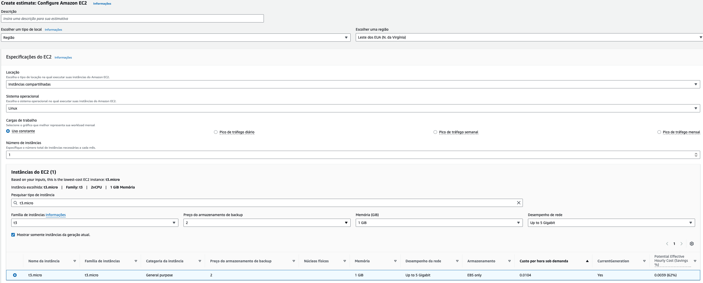
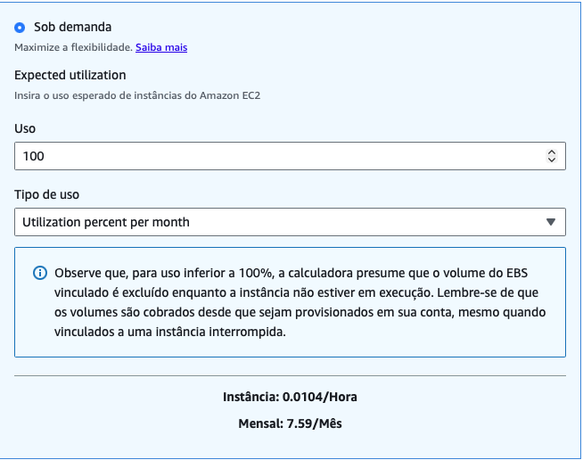
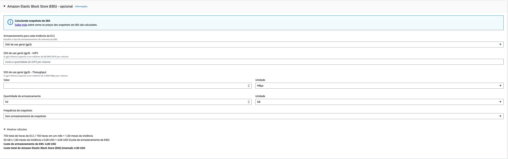
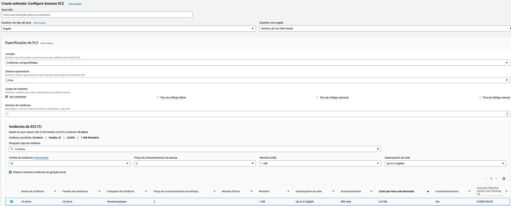
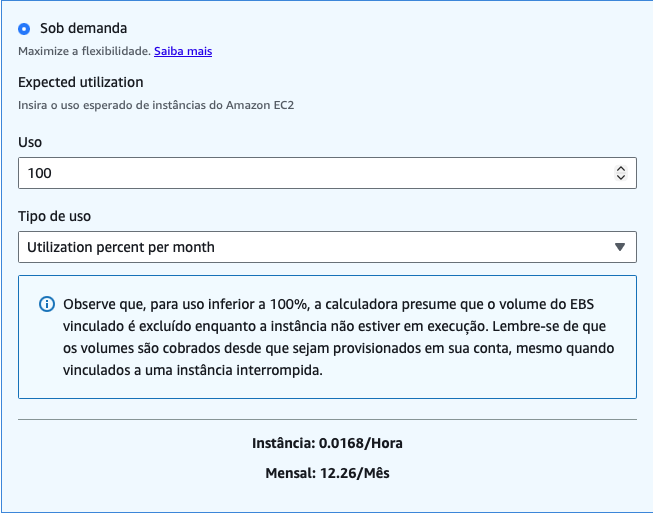
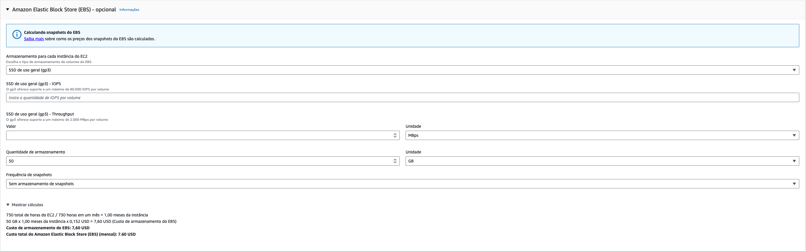

# FarmTech Solutions - Previsão de Rendimento de Safra

Bem-vindo ao repositório do projeto **FarmTech Solutions**! Este projeto foi desenvolvido para atender às necessidades de uma fazenda de médio porte (200 hectares) produtora de diversas culturas. Nosso objetivo é analisar uma base de dados agronômica para descobrir tendências de produtividade e construir modelos preditivos baseados em Machine Learning para prever o rendimento das safras.

## Objetivo do Projeto
Através de dados de clima (temperatura, umidade, precipitação) e do tipo de cultura, o time aplicou técnicas de Inteligência Artificial para:
1. **Análise Exploratória:** Entendimento das variáveis e comportamento dos dados agrícolas.
2. **Machine Learning Não Supervisionado:** Uso de clusterização para agrupar cenários semelhantes, explorar tendências e identificar dados discrepantes (outliers).
3. **Machine Learning Supervisionado:** Implementação e avaliação de 5 algoritmos de regressão para prever com precisão o rendimento em toneladas por hectare.

## 📂 Estrutura dos Dados
O projeto utiliza o arquivo `crop_yield.csv`, que contém as seguintes informações:
- **Cultura:** O nome da safra avaliada.
- **Precipitação (mm dia-1):** Quantidade de chuva diária.
- **Umidade específica a 2 metros (g/kg):** Vapor de água por kg de ar seco.
- **Umidade relativa a 2 metros (%):** Percentual de vapor de água em relação ao máximo suportado.
- **Temperatura a 2 metros (ºC):** Temperatura média na altura das plantações.
- **Rendimento:** Toneladas colhidas por hectare (Nossa variável alvo).

## Como acessar a solução
A solução completa com o passo a passo, limpeza de dados, implementação das lógicas de Machine Learning e conclusões se encontram no nosso **Jupyter Notebook**. 

Basta abrir o arquivo `farmtech_yield_prediction.ipynb` presente neste repositório. O notebook foi estruturado mesclando células de texto (Markdown), onde explicamos nossas decisões e conclusões, e células de código (Python) comentadas detalhadamente.

**Tecnologias utilizadas:** `Python`, `Pandas`, `Matplotlib`, `Seaborn`, `Scikit-Learn`.

📺 **[Assista ao vídeo da Entrega 1 aqui](https://youtu.be/cOxmKyWGHbk)**

---

## ☁️ Parte 2: Arquitetura em Nuvem e Implantação (AWS)

Para que o nosso modelo de Machine Learning saia do papel e possa receber os dados climáticos dos sensores da fazenda em tempo real, dimensionamos uma infraestrutura em nuvem utilizando a **Amazon Web Services (AWS)**. 

A máquina escolhida para hospedar nossa API e rodar o modelo foi parametrizada com a seguinte configuração mínima exigida:
- **Sistema Operacional:** Linux
- **vCPUs:** 2
- **Memória RAM:** 1 GiB
- **Banda de Rede:** Até 5 Gigabit
- **Armazenamento (EBS):** 50 GB
- **Modelo de Preço:** On-Demand (Sob demanda - 100% de utilização)

A instância que melhor atende a esses requisitos com o menor custo é a família **`t3.micro`** (junto a um volume EBS General Purpose SSD de 50 GB).

### 📊 Estimativa de Custos: Virgínia do Norte vs. São Paulo

Utilizamos a **AWS Pricing Calculator** para cotar e comparar o custo dessa infraestrutura em duas regiões diferentes. 

**Virginia**

**São Paulo**

| Recurso AWS (On-Demand) | Região: Virgínia do Norte (us-east-1) | Região: São Paulo (sa-east-1) |
| :--- | :--- | :--- |
| **Instância EC2 (`t3.micro`)** | ~ US$ 7,59 / mês | ~ US$ 12,26 / mês |
| **Armazenamento (50 GB EBS gp3)** | ~ US$ 4,00 / mês | ~ US$ 7,60 / mês |
| **Custo Total Mensal Estimado** | **~ US$ 11,59 / mês** | **~ US$ 19,86 / mês** |
*(Nota: Valores aproximados sujeitos à variação do dólar e taxas da AWS no momento do cálculo).*

**Qual é a solução mais barata?**
Financeiramente, hospedar a solução na região da **Virgínia do Norte (EUA)** é a opção mais barata, custando 41,64% menos do que a infraestrutura localizada no Brasil.

---

### ⚖️ Decisão Arquitetural: Restrições Legais e Latência

Apesar da região da Virgínia do Norte ser financeiramente mais atrativa, **nossa escolha arquitetural final para a FarmTech Solutions é a região de São Paulo (sa-east-1).**

**Justificativa:**
1. **Restrições Legais e Soberania de Dados:** O enunciado prevê que existem restrições legais para o armazenamento de dados no exterior. No Brasil, o agronegócio pode lidar com dados sensíveis de propriedades, contratos e geolocalização que esbarram em normativas federais ou políticas de conformidade rigorosas (como a LGPD). Manter os dados fisicamente no Brasil garante total *compliance* jurídico.
2. **Latência e Tempo de Resposta:** O cenário exige "acessar rapidamente os dados dos sensores". Como a fazenda e os sensores estão localizados no Brasil, uma requisição enviada para São Paulo tem uma latência média de 10 a 30 milissegundos. Se os dados viajassem até a Virgínia (EUA), essa latência subiria para 110 a 150 milissegundos. Para sistemas de IoT e leitura de sensores em tempo real, a proximidade geográfica de São Paulo evita gargalos de rede e garante respostas ágeis da nossa API.

Portanto, o custo adicional da região de São Paulo é plenamente justificado e necessário para garantir a conformidade legal e a performance técnica exigida pelo negócio.

---

### 🎥 Demonstração da Calculadora AWS (Vídeo)
Para detalhar o processo de cotação e a escolha da configuração, preparamos um vídeo demonstrativo utilizando a calculadora oficial da AWS.

📺 **[Assista ao vídeo da Entrega 2 aqui](https://youtu.be/IrirD8NyMSw)**
